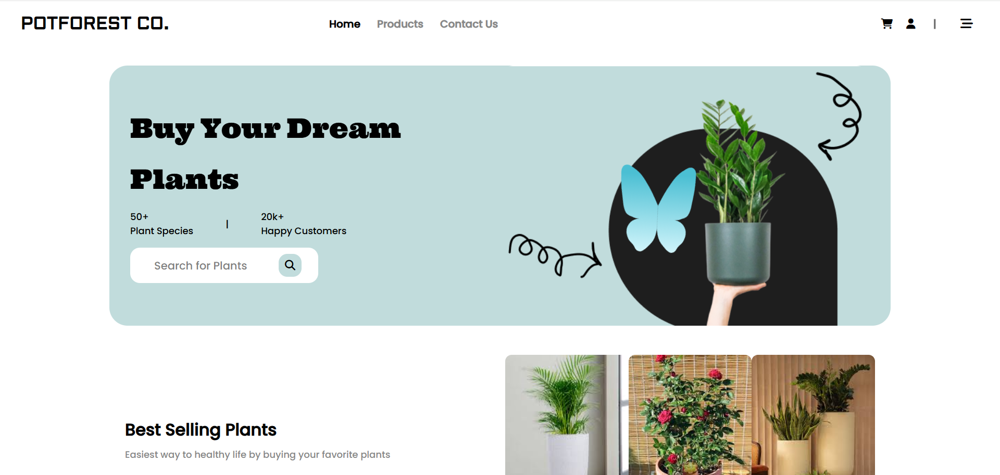
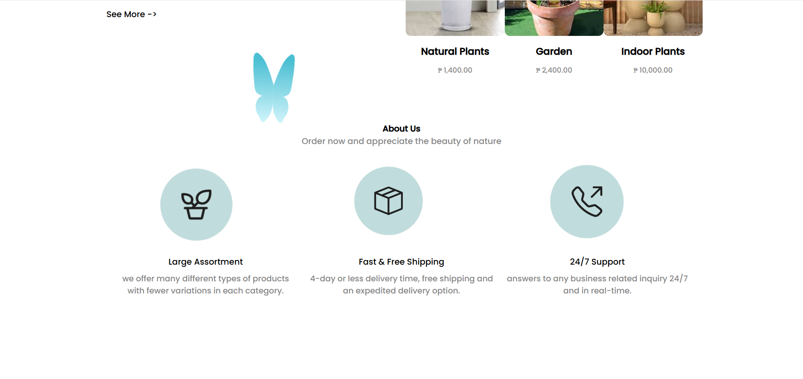
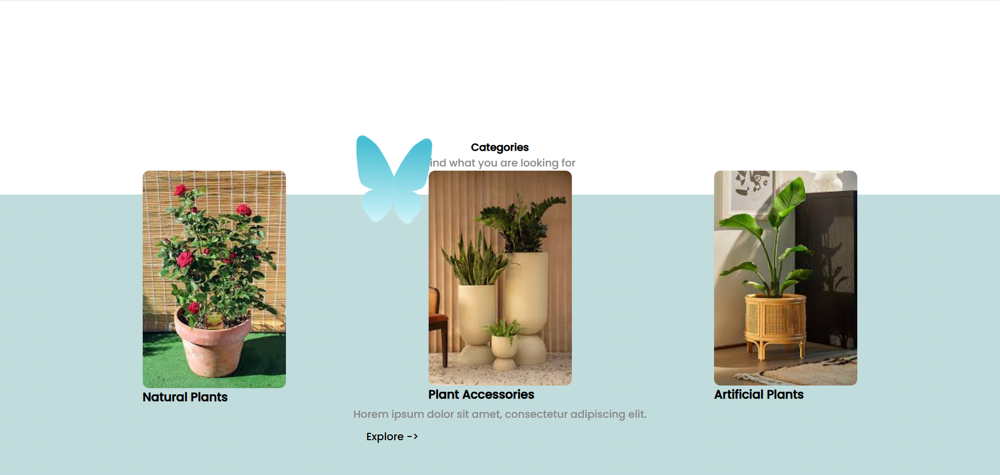
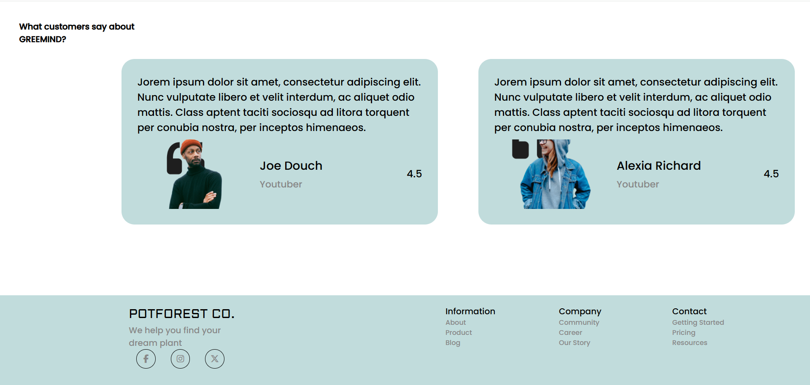
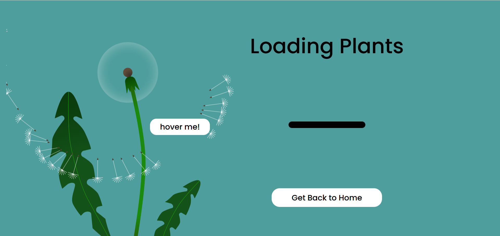
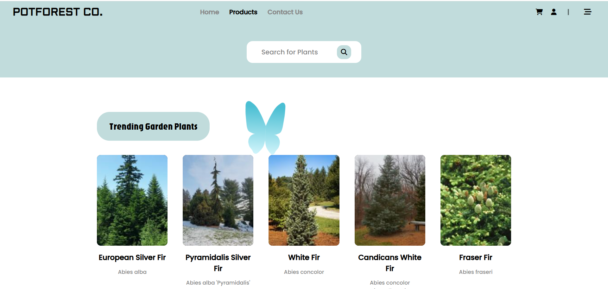
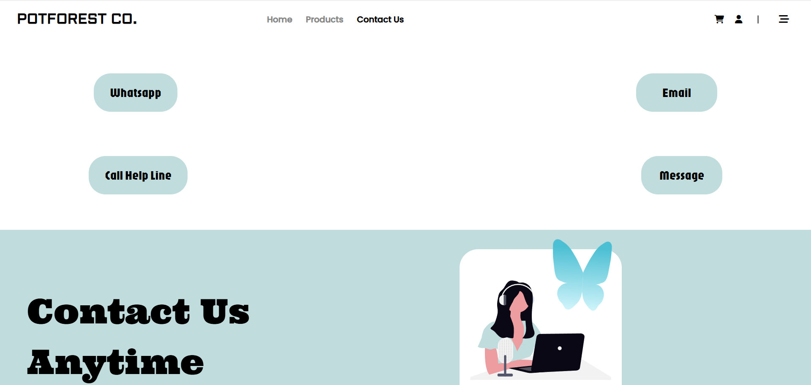
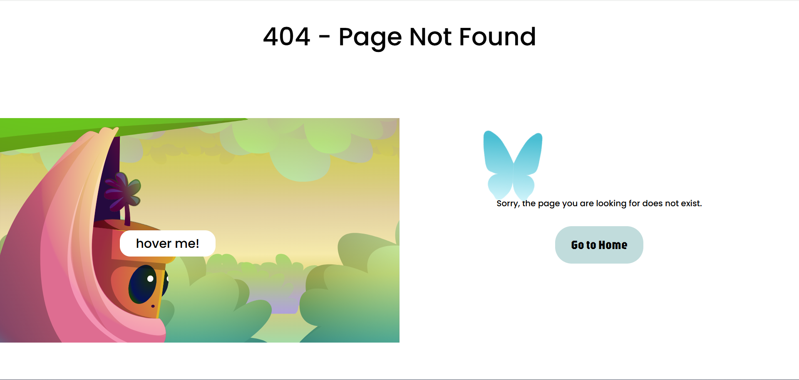

# 🌿 POTFOREST CO. — E-Commerce for Plant Lovers


> A modern, featured plant e-commerce store built with React — browse, discover, and shop beautiful plants from the comfort of your home.

---

## 📸 Preview









---

## ✨ Features

- 🛍️ **Product Listings** — Browse a rich catalog of plants with details and images
- 🔍 **Search & Filter** — Easily find plants by category, price, or name
- 📱 **Responsive Design** — tablet, and desktop

### 🎨 UI/UX Design
- 🌿 **Plant-Themed Design System** — Custom color palette, typography, and components built around a natural aesthetic
- 📱 **Responsive** — Pixel-perfect layout across tablet, and desktop
- 🎯 **Intuitive Navigation** — Clean layout with clear visual hierarchy and call-to-actions
- 🖼️ **Optimized Images** — React.js `<Image />` for lazy loading and automatic resizing
- 🌙 **Consistent Design Language** — Reusable components with CSS Modules for scoped, maintainable styles

### 🎬 Animations
- ⚡ **GSAP Powered Transitions** — Smooth, high-performance page and element animations
- 🎭 **Rive Interactive Graphics** — Real-time interactive animated illustrations
- 🌊 **Scroll-Triggered Animations** — Elements animate in as you scroll down the page
- 🖱️ **Micro-interactions** — Subtle hover effects, button feedback, and loading states
- 🃏 **Product Card Animations** — Smooth reveal and hover effects on plant cards
- 📦 **Page Transition Effects** — Seamless animated transitions between routes
---

## 🛠️ Tech Stack

| Technology | Purpose | Version |
|------------|---------|---------|
| [React.js](https://reactjs.org/) | UI Component Library | 18+ |
| [Tailwind CSS](https://tailwindcss.com/) | Utility-First Styling | 3+ |
| [GSAP](https://greensock.com/gsap/) | High-Performance Animations | 3+ |
| [Rive](https://rive.app/) | Interactive Animated Graphics | Latest |
| [CSS Modules](https://github.com/css-modules/css-modules) | Scoped Component Styling | — |
| [Git](https://git-scm.com/) | Version Control | — |
| [GitHub](https://github.com/) | Code Hosting & Collaboration | — |

---

## 🚀 Getting Started

### Prerequisites

Make sure you have the following installed:

- [Node.js](https://nodejs.org/) (v18 or higher)
- [npm](https://www.npmjs.com/) or [yarn](https://yarnpkg.com/)

### Installation

1. **Clone the repository**
   ```bash
   git clone https://github.com/your-username/plant-ecommerce.git
   cd plant-ecommerce
   ```

2. **Install dependencies**
   ```bash
   npm install
   # or
   yarn install
   ```


3. **Run the development server**
   ```bash
   npm run dev
   # or
   yarn dev
   ```

4. Open [http://localhost:3000](http://localhost:3000) in your browser 🎉

---

## 📁 Project Structure

```
plant-ecommerce/
├── .github/               # GitHub config & workflows
├── public/                # Static assets (favicon, fonts)
├── Screenshots/           # README screenshots
├── src/
│   ├── animations/        # GSAP & Rive animation logic
│   ├── assets/            # Images, icons, SVGs
│   ├── components/        # Reusable React components
│   ├── context/           # React Context (global state)
│   ├── features/          # Feature-based modules
│   ├── pages/             # App pages / route components
│   ├── routes/            # React Router route definitions
│   ├── styles/            # Global & module CSS files
│   ├── App.css            # App-level styles
│   ├── App.jsx            # Root component
│   ├── index.css          # Base styles
│   └── main.jsx           # App entry point
├── .env                   # Environment variables
├── .gitignore             # Git ignored files
├── eslint.config.js       # ESLint configuration
├── index.html             # HTML entry point
├── package.json           # Dependencies & scripts
├── vite.config.js         # Vite configuration
└── README.md              # Project documentation
```

## 📦 Available Scripts

| Command | Description |
|---------|-------------|
| `npm run dev` | Start development server |
| `npm run build` | Build for production |
| `npm run start` | Start production server |
| `npm run lint` | Run ESLint |

---

## 🌱 Roadmap

- [x] Home page
- [x] Product listings / Shop page
- [x] GSAP animations
- [x] Rive interactive graphics
- [x] Responsive design
- [x] CSS Modules + Tailwind styling
- [ ] Shopping cart
- [ ] User authentication
- [ ] Checkout & payments
- [ ] Product search & filter

---

## 📄 License

This project is licensed under the MIT License — see the [LICENSE](./LICENSE) file for details.

---
## 👤 Author

**MAYURESHWAR S**

[](https://github.com/MAYURESHWAR-SHIVAPUR)
[](https://www.linkedin.com/in/mayureshwar-shivapur-a34b25313/)
[](https://animate-with-mayur.netlify.app/)
> 🔐 Portfolio is password protected — password: `4002`

---

<p align="center">Made with ❤️ and lots of 🌿</p>